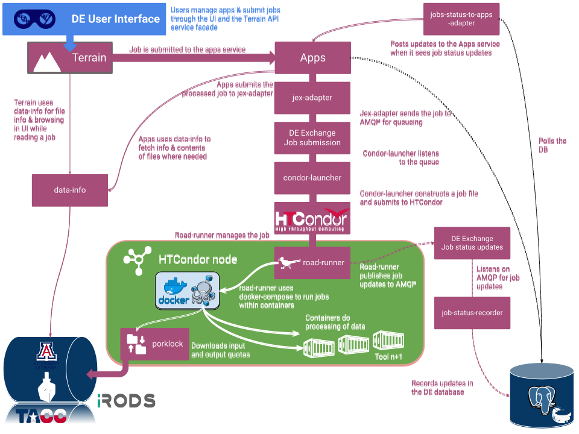
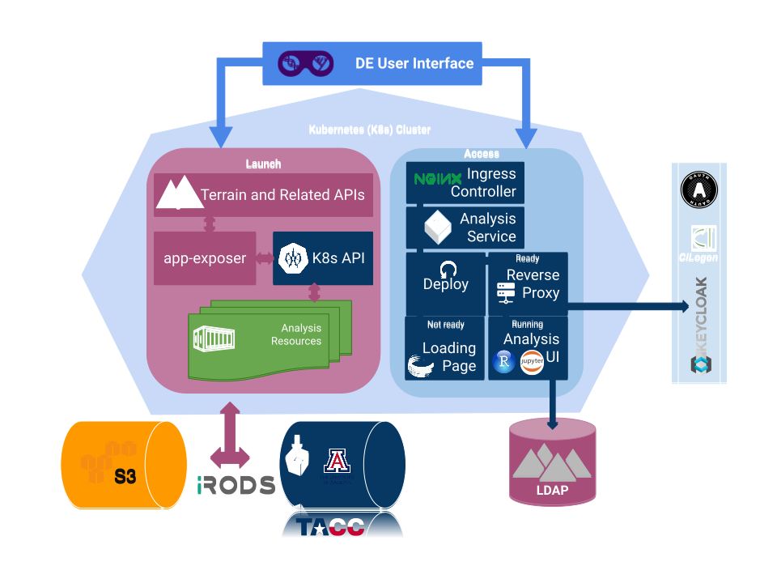

[Discovery Environment User Guide](https://learning.cyverse.org/de/){target=_blank}

Deployment of the Discovery Environment (DE) is provided in the [Deployments section](../deployments/DiscoveryEnvironment.md)

**Figure** DE `executable` jobs use HTCondor

**Figure** DE `interactive` jobs use K8s

# Infrastructure

The following sections describe the key components of the infrastructure upon which the DE operates.

## [Data Store](ds.md)

The DE provides access and management of data via the CyVerse 
[Data Store](http://www.cyverse.org/ci/data-store), which is built on top of 
[iRODS](http://irods.org/).

## Compute Platform(s)

The DE integrates the Data Store with [HTCondor](https://research.cs.wisc.edu/htcondor/) and the
[Agave Platform](http://agaveapi.co/) to provide a large set of tools for performing resource
intense analyses.

## PostgreSQL

Nearly all applications use a database. The DE is backed by a  [PostgreSQL](http://www.postgresql.org/) database. 

The schema can be found in the [databases]() section

## RabbitMQ

[RabbitMQ](https://www.rabbitmq.com/) is used throughout our services, but primarily to integrate our services with iRODS.

## Elasticsearch

The DE uses [Elasticsearch](https://www.elastic.co/products/elasticsearch) to provide search and  other capabilities.

## Docker

[Docker](https://www.docker.com/) is used throughout the DE architecture. Most importantly, all of  the tools that run in the DE's HTCondor cluster run within docker containers, allowing us to  integrate new tools without affecting existing tools.

Additionally, the components of the DE application are packaged as Docker containers.

All of these images can be accessed through our organization page on 
[Docker Hub](https://hub.docker.com/r/discoenv/).

# Architecture

The DE is composed of backend services and a user interface (UI).

## Backend Services

The DE backend is built as a micro-services architecture. Each of these services are contained in  the [services/]({{site.github.repository_url}}/tree/master/services) folder.

The functionality of the micro-service architecture is aggregated in the `Terrain` service, and exposed as a RESTful [api]({{site.github.url}}/api).

More information about the backend micro-service architecture and implementation may be found [here]({{site.github.url}}/services).

## UI

All of the UI services are provided by the DE api. The application itself is built with [GXT](https://www.sencha.com/products/gxt/), a UI component library built on top of [GWT](http://www.gwtproject.org/). 

[de]: ../assets/de/deIcon.svg

## [![][de]{width=50}](https://user.cyverse.org/services/2){target=_blank} Discovery Environment

Here you will find all the :simple-github: GitHub repositories for all services: 

[:simple-github: analyses](https://github.com/cyverse-de/analyses){target=_blank}  : Provides a HTTP API for interacting with analyses in the Discovery Environment.

[:simple-github: app-exposer](https://github.com/cyverse-de/app-exposer){target=_blank}  : This is a service that runs inside of a Kubernetes cluster namespace and implements CRUD operations for exposing interactive apps as a Service and Endpoint.

[:simple-github: apply-labels](https://github.com/cyverse-de/apply-labels){target=_blank}  : A small service in the Discovery Environment backend that periodically hits the app-exposer service to trigger the application of labels on VICE-related K8s resources

[:simple-github: apps](https://github.com/cyverse-de/apps){target=_blank}  : apps is a platform for hosting App Services for the Discovery Environment web application.

[:simple-github: async-tasks](https://github.com/cyverse-de/async-tasks){target=_blank}  : This service tracks and manages asynchronous tasks throughout the DE backend services.

[:simple-github: bulk-typer](https://github.com/cyverse-de/bulk-typer){target=_blank}  : Like info-typer, but a bunch at once. hopefully.

[:simple-github: check-resource-access](https://github.com/cyverse-de/check-resource-access){target=_blank}  : Looks up the permissions that a subject has for a resource. By default, the subject type is 'user' and the resource type is 'analysis'. Only performs look ups against the permissions service.

[:simple-github: clockwork](https://github.com/cyverse-de/clockwork){target=_blank}  : Scheduled jobs for the CyVerse Discovery Environment.

[:simple-github: dashboard-aggregator](https://github.com/cyverse-de/dashboard-aggregator){target=_blank}  : Gathers data to populate the dashboard in Sonora.

[:simple-github: data-info](https://github.com/cyverse-de/data-info){target=_blank}  : data-info is a RESTful frontend for getting information about and manipulating information in an iRODS data store.

[:simple-github: data-usage-api](https://github.com/cyverse-de/data-usage-api){target=_blank}  : A service that provides an API around data usage tracking, and updates data usage numbers on request or periodically.

<del>[de-mailer](https://github.com/cyverse-de/de-mailer){target=_blank}  :  A go module that send email notifications to users. This module will support HTML and rich text emails.</del\>

:simple-github: de-nginx

<del>[de-stats](https://github.com/cyverse-de/de-stats){target=_blank}  : Service for obtaining CyVerse Discovery Environment stats and metrics.</del>

[:simple-github: de-webhooks](https://github.com/cyverse-de/de-webhooks){target=_blank}  : A service that listens to AMQP queues for DE notifications, check if the user has webhooks defined for that notification type and then post the notification to webhook if one is defined.

[:simple-github: dewey](https://github.com/cyverse-de/dewey){target=_blank}  : An AMQP message based iRODS indexer for elasticsearch.

[:simple-github: email-requests](https://github.com/cyverse-de/email-requests){target=_blank}  : A simple service to wait for email requests to arrive over AMQP and forward them to cyverse-email.

[:simple-github: event-recorder](https://github.com/cyverse-de/event-recorder){target=_blank}  : This service listens to an AMQP topic for events, and records events that may be of interest to users in the notifications database.

[get-analysis-id]() : TODO: FIND the repo.

[grouper]() : - `grouper-loader` & `grouper-ws` TODO: FIND the repo.   - From kubectl apply

[:simple-github: info-typer](https://github.com/cyverse-de/info-typer){target=_blank}  : An AMQP message based info type detector

[:simple-github: infosquito2](https://github.com/cyverse-de/infosquito2){target=_blank}  : TODO FIND description.

[:simple-github: iplant-groups](https://github.com/cyverse-de/iplant-groups){target=_blank}  : A RESTful facade in front of [Grouper](https://incommon.org/software/grouper/).

[:simple-github: jex-adapter](https://github.com/cyverse-de/jex-adapter){target=_blank}  : TODO FIND description.

[:simple-github: job-status-recorder](https://github.com/cyverse-de/job-status-recorder){target=_blank}  : TODO FIND description.

[:simple-github: job-status-listener](https://github.com/cyverse-de/job-status-listener){target=_blank}  : Listens over HTTP for job status updates, then publishes them to AMQP.

[:simple-github: kifshare](https://github.com/cyverse-de/kifshare){target=_blank}  : A simple web page that allows users to download publicly available files without a CyVerse account.

[local-exim (exim-sender)](): TODO: FIND the repo. - From kubectl

[:simple-github: metadata](https://github.com/cyverse-de/metadata){target=_blank}  : The REST API for the Discovery Environment Metadata services.

[:simple-github: monkey](https://github.com/cyverse-de/monkey){target=_blank}  : This is a service that synchronizes the tag documents in the data search index with the metadata database

[:simple-github: notifications](https://github.com/cyverse-de/notifications){target=_blank}  : This service provides the RESTful API for the revised notification system.

[:simple-github: permissions](https://github.com/cyverse-de/permissions){target=_blank}  : This service manages permissions for the Discovery environment.

[:simple-github: requests](https://github.com/cyverse-de/requests){target=_blank}  : Service for managing administrative requests in the CyVerse Discovery Environment.

[:simple-github: terrain](https://github.com/cyverse-de/terrain){target=_blank}  : Terrain provides the primary REST API used by the Discovery Environment. Its role is to validate user authentication and to coordinate calls to other web services. For more information, please see the [Discovery Environment API Documentation](https://cyverse-de.github.io/api/){target=_blank} .

[:simple-github: resource-usage-api](https://github.com/cyverse-de/resource-usage-api){target=_blank}  :  is a microservice developed as part of the CyVerse Discovery Environment that provides access to resource usage values (CPU hours, memory, etc.) consumed by users over a customizable time period.

<del>[saved-searches](https://github.com/cyverse-de/saved-searches){target=_blank}  : A service for the CyVerse Discovery Environment that provides CRUD access to a user's saved searches.</del>

[:simple-github: search](https://github.com/cyverse-de/search){target=_blank}  : This is a service which serves as a search facade for the DE and others to use. It uses the querydsl 
library under the covers to translate requests and provide documentation, then passes off queries to configured elasticsearch servers.

[:simple-github: sonora](https://github.com/cyverse-de/sonora){target=_blank}  : UI for the Discovery Environment

[:simple-github: templeton](https://github.com/cyverse-de/templeton){target=_blank}  : includes `templeton-incremental` & `templeton-periodic` TODO: add description.

[:simple-github: timelord](https://github.com/cyverse-de/timelord){target=_blank}  : timelord periodically queries the DE database for running applications and kills any of them that have gone over their time limit.

[unleash]() : TODO: FIND the repo. - From kubectl apply

[:simple-github: user-info](https://github.com/cyverse-de/user-info){target=_blank}  : A service for getting user-related information like sessions and preferences.

[:simple-github: vice-default-backend](https://github.com/cyverse-de/vice-default-backend){target=_blank}  : Provides a default backend handler for the Kubernetes Ingress that handles routing for VICE apps. This backend decides whether to redirect requests to the loading page service, the landing page service, or to a 404 page depending on whether the URL is valid or not.

[:simple-github: qms-adapter](https://github.com/cyverse-de/qms-adapter){target=_blank}  : Forwards usage information gathered within the Discovery Environment to the Quota Management System [QMS](https://github.com/cyverse/QMS

[:simple-github: qms](https://github.com/cyverse/QMS){target=_blank}  : QMS is the CyVerse Quota Management System. Its purpose is to keep track of resource usage limits and totals for CyVerse users.

[irods-csi-driver](https://github.com/cyverse/irods-csi-driver){target=_blank}  : iRODS Container Storage Interface (CSI) Driver implements the [CSI Specification](https://github.com/container-storage-interface/spec/blob/master/spec.md){target=_blank}  to provide container orchestration engines (like Kubernetes) iRODS access.

<del>[dataone-indexer](https://github.com/cyverse-de/dataone-indexer){target=_blank}  : Event indexer for the DataONE member node service.</de

## Non-Core Services

1. redis-ha

2. redis-haproxy

3. elasticsearch (opensearch)

5. keycloak

6. openebs
